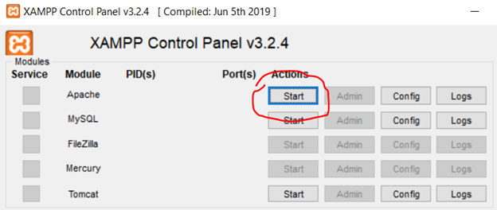
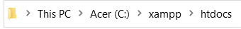
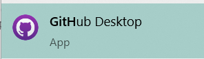
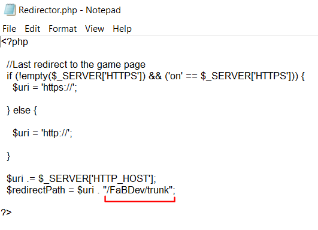

# Local Quickstart Guide

read original [here](https://docs.google.com/document/d/1qVlTrst58iZ_6xD9PkxIgZUiSKzV-S4eTJmK32qzaP0)

Download and install webserver

- XAMPP (https://www.apachefriends.org/download.html)
- The rest of this guide will assume you used XAMPP
  Every time you start up your computer to do development, you will need to re-start your webserver from the console. It looks like this:
  

Click Start for Apache:



(It should turn green)

Find where XAMPP got installed. In the install directory, there should be a folder called htdocs. This is the root node of your webserver. Here is what mine looks like (yours could be different):



Now you need to create a local git repository in htdocs. I recommend using GitHub Desktop. Once it’s installed, it looks like this:



To get access to the github repo, contact OotTheMonk#7276 on Discord.

Make sure you create the repo somewhere inside the XAMPP htdocs folder. It does not matter where. Once you’ve fetched the files from the trunk, it should look something like this:


You’re already most of the way done! Inside the HostFiles folder, there are some things to set up.


If you don’t have a GameIDCounter.txt, you need to create one. Inside, just add a number. This number determines the ID of the next game, so it doesn’t really matter what the number is. But I recommend 0 so you know how many games have been created.

You will need to create a file called Redirector.php. It is not stored in the repo, because otherwise commits from others will mess up your local copy. You also need to define the path from your webserver root node to where the repo actually is. This is what mine looks like, and what needs to be changed:



Here is the text to copy:

```php
<?php
  //Last redirect to the game page
  if (!empty($_SERVER['HTTPS']) && ('on' == $_SERVER['HTTPS'])) {
    $uri = 'https://';
  } else {
    $uri = 'http://';
  }
  $uri .= $_SERVER['HTTP_HOST'];
  $redirectPath = $uri . "/FaBDev/trunk";
?>
```

Note for Linux: The directory with the file must be readable for root or the user that executes the server.
